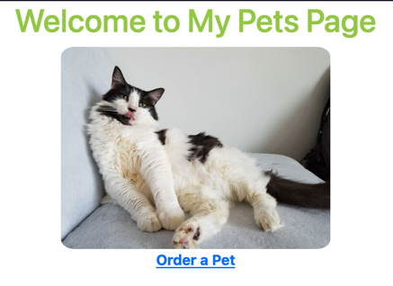
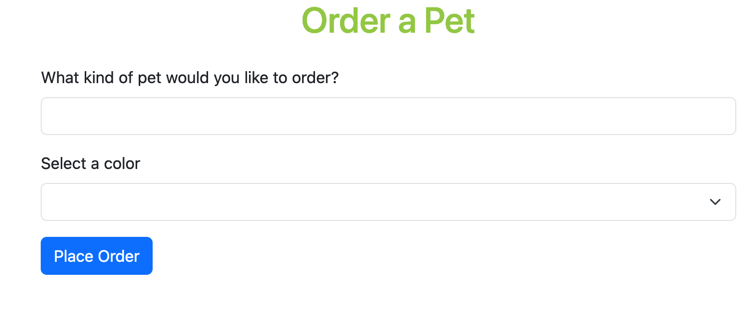
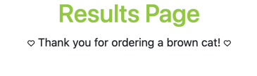

# pets2
### Project Description
This project is for Green River College's SDEV 328 (Full Stack Web Development) course with
[Tina Ostrander](https://www.linkedin.com/in/tinaostrander).
This Pets2 in-class assignment has a simple ordering form and ordering confirmation page, with routing via the PHP
Fat-Free Framework.

### How to Run the Project
1. Clone the repository locally with `git clone https://github.com/tien-han/pets2.git` (in the terminal).
2. Download the PHP dependency manager Composer with `composer install` (in the terminal).
3. That's it - you can now run the code in your favorite IDE and test it out in the browser!

###  How to Use the Project
This simple project has three pages:

1. A default homepage that includes a clickable link to the "Order a Pet" form.

2. A simple pet ordering form.

3. A confirmation page for the ordering form.
